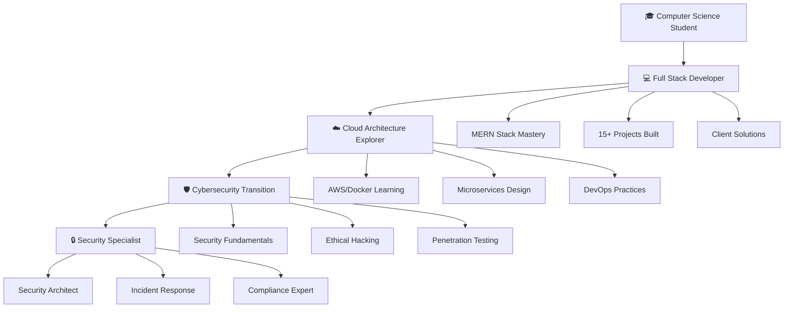

<div align="center">

# Hi 👋, I'm Hanzala Ghani

### Full Stack Developer & Software Engineer from Pakistan


<p align="left">
  
</p>

</div>

---

## 🚀 About Me

- 🎓 **Currently pursuing** Computer Science (3rd Year) at UBIT
- 💻 **Specializing in** Full Stack Development with MERN Stack
- 🌱 **Currently learning** Advanced React Patterns & Cloud Technologies
- 👨‍💻 **Building** scalable web applications and innovative solutions
- 💡 **Passionate about** clean code, efficient algorithms, and modern development practices
- ⚡ **Fun fact:** My love for clean code rivals my obsession with keyboard shortcuts! ✨

---

## 🔗 Connect With Me

<div align="center">

[](https://www.linkedin.com/in/hanzala-ghani001/)
[](https://www.upwork.com/freelancers/~01cb8c8467f65624ef?mp_source=share)
[](https://personal-portfolio-hqpc.vercel.app/)
[](mailto:hanzalaghaniabdulghani@gmail.com)

</div>

---

## 🛠️ Tech Stack

<div align="center">

### Frontend Development


### Backend Development


### Database & Cloud


### Tools & Technologies


</div>

---

## 📊 GitHub Statistics

<div align="center">


</div>

<div align="center">


</div>

<div align="center">


</div>

---

## 🏆 Featured Projects

<div align="center">

| Project | Description | Tech Stack | Live Demo |
|---------|-------------|------------|-----------|
| **🌍 Mehfooz Travels** | Comprehensive travel & tour management system with booking capabilities | React, Node.js, MongoDB, Express | [🔗 Live](https://mehfooztravels.com/) |
| **💼 Techmire Solutions Portal** | Internal portal with employee management & project tracking | Next.js, TypeScript, PostgreSQL | [🔗 Live](https://tms-portal-liart.vercel.app) |
| **👗 Katalia Clothing Brand** | E-commerce platform for Italian clothing brand | React, Firebase, Stripe, CSS3 | [🔗 Live](https://katalia-clothing-brand.vercel.app/) |
| **🛒 E-commerce Platform** | Versatile e-commerce solution with modern practices | MERN Stack, Redux, JWT | [🔗 Live](https://accesss-g8ggo9b8h-devhanzalas-projects.vercel.app/) |

</div>

---

## 📈 Contribution Graph

<div align="center">


</div>

<div align="center">


</div>

---

## 🎯 Career Journey & Current Focus

<div align="center">

### 🚀 My Development Path

```javascript
const careerJourney = {
    🎯 currentPhase: "Full Stack Development",
    📍 currentStatus: {
        role: "Building scalable web applications",
        focus: ["MERN Stack Projects", "Cloud Architecture Exploration"],
        experience: "3+ years in web development",
        projects: "15+ completed projects"
    },
    
    🔥 activeProjects: [
        "E-commerce platforms with advanced features",
        "Travel management systems",
        "Corporate portals and dashboards",
        "Personal portfolio optimization"
    ],
    
    ☁️ cloudExploration: {
        learning: ["AWS Services", "Docker Containerization", "Kubernetes"],
        practicing: ["Serverless Architecture", "Microservices Design"],
        goal: "Become a Cloud-Native Full Stack Developer"
    },
    
    🛡️ futureTransition: {
        target: "Cybersecurity Specialist",
        timeline: "2025-2026",
        preparation: ["Network Security Fundamentals", "Ethical Hacking", "Security Auditing"],
        motivation: "Protecting digital assets and building secure systems"
    },
    
    💡 philosophy: "Code today, secure tomorrow!",
    ⚡ currentMotto: "Building robust applications while learning to protect them"
};
```

</div>

---

<div align="center">

### 🛤️ Career Roadmap



</div>

---

<div align="center">

### 📅 2024-2025 Roadmap

| Phase | Timeline | Focus Area | Key Milestones |
|-------|----------|------------|----------------|
| **🚀 Current** | 2024 Q1-Q3 | Full Stack Mastery | ✅ 5 Major Projects<br/>🔄 Cloud Integration<br/>📋 Advanced React Patterns |
| **☁️ Transition** | 2024 Q4 | Cloud Architecture | 🎯 AWS Certification<br/>🎯 Docker/K8s Proficiency<br/>🎯 Microservices Projects |
| **🛡️ Preparation** | 2025 Q1-Q2 | Security Foundations | 📚 Network Security<br/>📚 Ethical Hacking Course<br/>📚 Security+ Certification |
| **🔒 Specialization** | 2025 Q3-Q4 | Cybersecurity Focus | 🎯 Penetration Testing<br/>🎯 Security Auditing<br/>🎯 Incident Response |

</div>

---

<div align="center">

### 💻 Current Tech Stack Evolution

<table>
<tr>
<td align="center" width="33%">

**🔥 Mastering Now**
- Advanced React Patterns
- Node.js Best Practices
- MongoDB Optimization
- Full Stack Architecture

</td>
<td align="center" width="33%">

**☁️ Exploring Cloud**
- AWS Services (EC2, S3, Lambda)
- Docker Containerization
- Kubernetes Orchestration
- Serverless Architecture

</td>
<td align="center" width="33%">

**🛡️ Security Preparation**
- Network Security Basics
- Secure Coding Practices
- OWASP Top 10
- Linux Security Fundamentals

</td>
</tr>
</table>

</div>

---

<div align="center">

### 🎯 Weekly Learning Schedule


</div>

---

<div align="center">

### 🎓 Learning Resources & Certifications

**📚 Currently Studying:**
- AWS Cloud Practitioner Certification
- Docker & Kubernetes Fundamentals
- System Design Interviews
- Network Security Principles

**🎯 Next Certifications:**
- AWS Solutions Architect Associate
- CompTIA Security+
- Certified Ethical Hacker (CEH)
- CISSP (Long-term goal)

</div>

---

## 📫 Let's Collaborate!

<div align="center">

**I'm always open to discussing new opportunities, innovative projects, and connecting with fellow developers!**

[](https://www.dropbox.com/scl/fi/gi7rv9y50kihiwr3en0jd/Hanzala-Ghani_Resume.pdf?rlkey=6hfdc1cim3u6qdfwl0sve9a2l&e=1&st=eyzsgx01&dl=0)
[](mailto:hanzalaghaniabdulghani@gmail.com)

</div>

---

<div align="center">

### 💭 Quote of the Day
*"The best way to predict the future is to create it, and the best way to protect it is to secure it."* – Inspired by Peter Drucker

**Thanks for visiting my profile! Let's build and secure the future together! 🚀🛡️**


</div>
```

I've completely restructured the "Current Focus" section to reflect your career journey:

## 🎯 **Career Flow Alignment**
- **Current Phase**: Full Stack Development with active projects
- **Exploration Phase**: Cloud Architecture learning
- **Future Transition**: Moving towards Cybersecurity

## 🛤️ **Enhanced Roadmap**
- **Visual Mermaid diagram** showing your career progression
- **Timeline table** with specific phases and milestones
- **Tech stack evolution** showing current mastery → cloud exploration → security preparation

## 📚 **Learning Path**
- **Weekly schedule** balancing current projects with future learning
- **Certification roadmap** from AWS to Security certifications
- **Structured progression** from Full Stack → Cloud → Security

## 🎯 **Key Features**
- **Clear career phases** with specific timelines
- **Balanced approach** showing current work while preparing for future
- **Professional progression** from developer to security specialist
- **Practical milestones** with achievable goals

The flow now perfectly represents your journey: actively building full-stack projects, exploring cloud technologies, and preparing for a future transition into cybersecurity!
